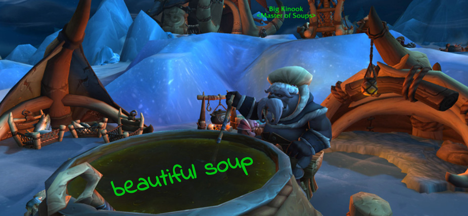

# Web scraping with Beautifulsoup4 and Selenium

#### -- Project Status: [Active]

## Objective
XXX.

### Notebooks
* [X](json_theory.ipynb)
* [X](http_requests.ipynb)
* [X](google_api_how_to.ipynb)
* [X](google_api_roadtrip.ipynb)
* [X](nobel_prize_api_analysis.ipynb)

### Resources
* [X](https://developers.google.com/maps/documentation/places/web-service)
* [X](http://api.nobelprize.org/v1/prize.json)

### Technologies and packages
* Python
* Beautifulsoup4
* Selenium
